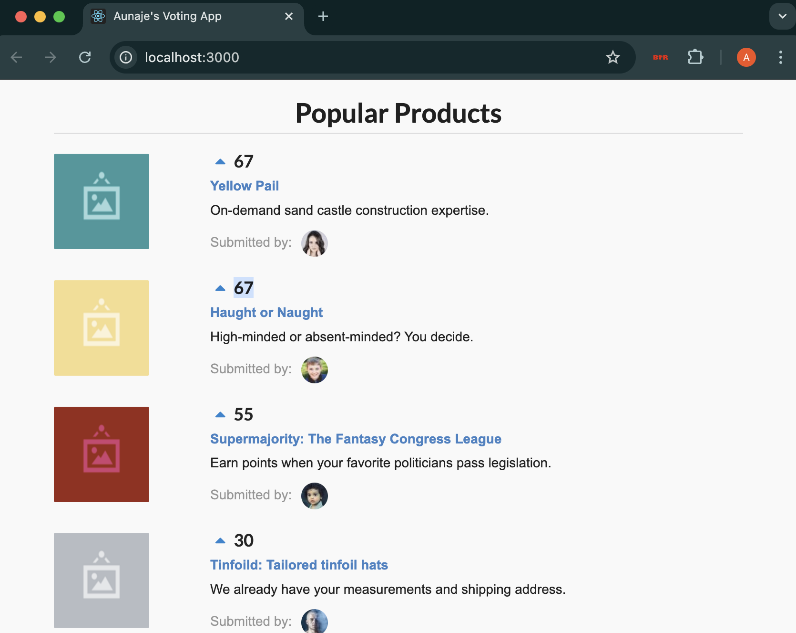

# Aunaje's Voting App

## Description

A simple React voting app where users can vote for their favorite products. The products are automatically sorted based on the number of votes. This app features real-time vote updates and dynamic sorting to highlight the most popular items at the top. It also showcases a clean, responsive design using React components.

## Run-Time Instructions

**Note:** The `node_modules` folder was excluded from the repository to reduce file size. Running `npm install` will restore all necessary dependencies. Additionally, product images are stored locally in the `public/assets` folder.

### Prerequisites

Ensure **Node.js** and **npm** are installed on your machine. You can download them from [https://nodejs.org](https://nodejs.org).

### How to Run the App

1. **Clone the Repository:**

   ```bash
   git clone https://github.com/aunajec/voting-app.git
   cd voting-app
   ```

2. **Install Dependencies:**

   ```bash
   npm install
   ```

3. **Start the Application:**

   ```bash
   npm start
   ```

4. **Open the App in Your Browser:**  
   Go to:

   ```
   http://localhost:3000
   ```

### How to Use the App

- Click the **Vote** button next to a product to increase its votes.
- The products will reorder in real-time, showing the highest-voted products at the top.
- **Product images** are stored locally in the **`public/assets`** folder.

## Screenshot



---

## Technologies Used

- **React**
- **JavaScript**
- **HTML/CSS**
- **Semantic UI React**

## Author

Aunaje' Caldwell

---

Feel free to fork this repository, create pull requests, or submit issues for bugs or suggestions!
